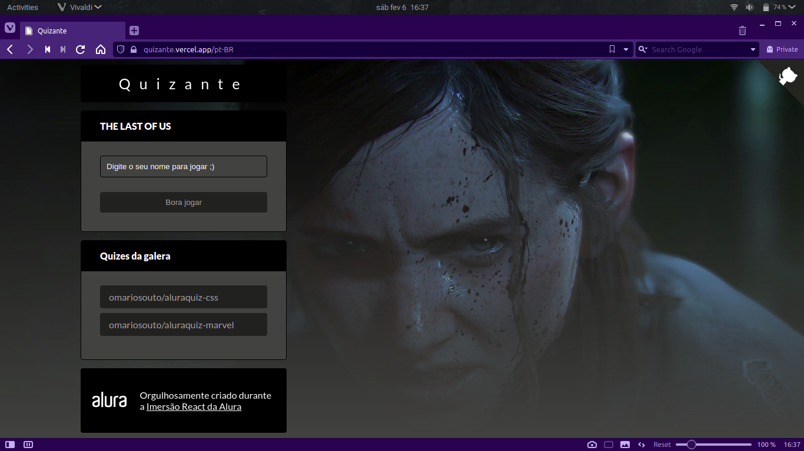
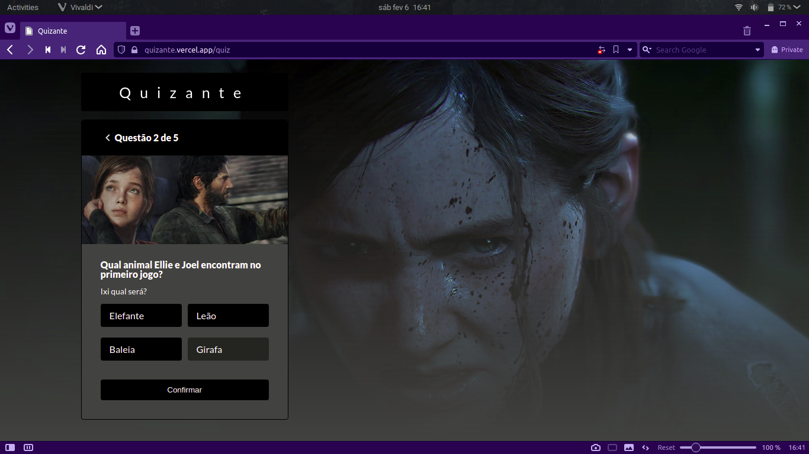
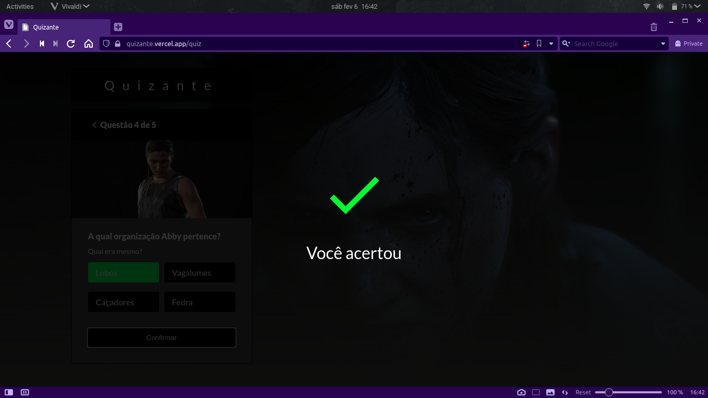
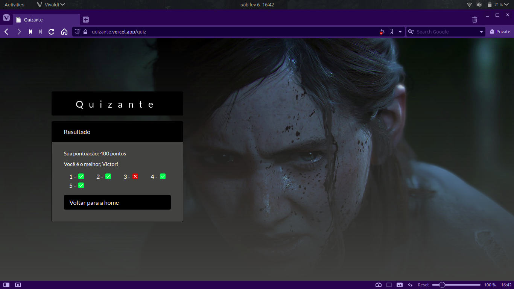
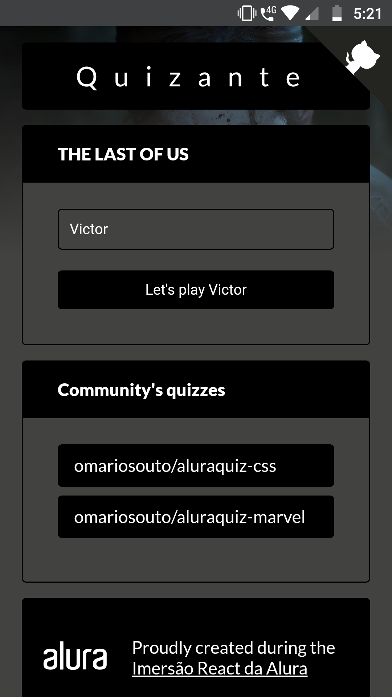
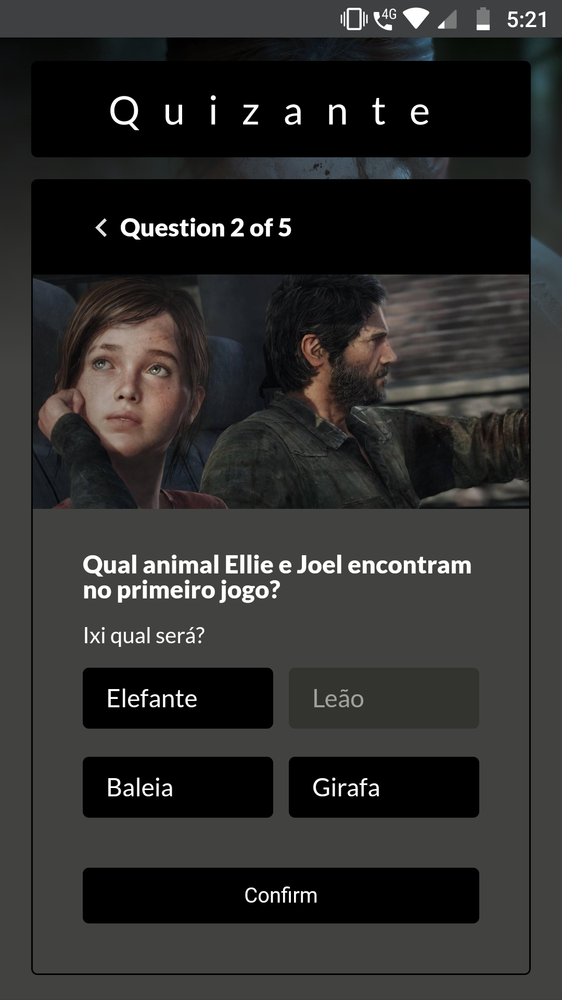
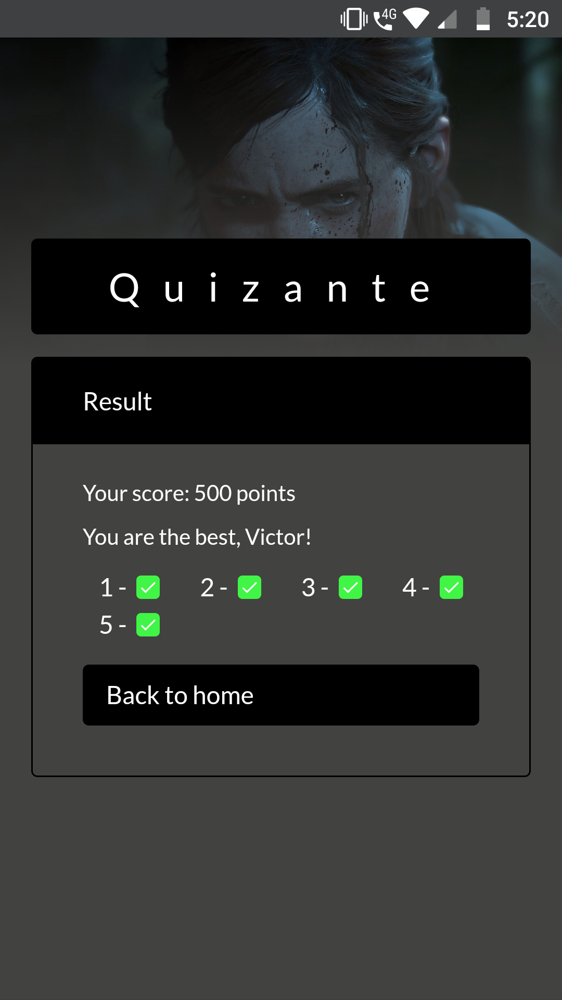
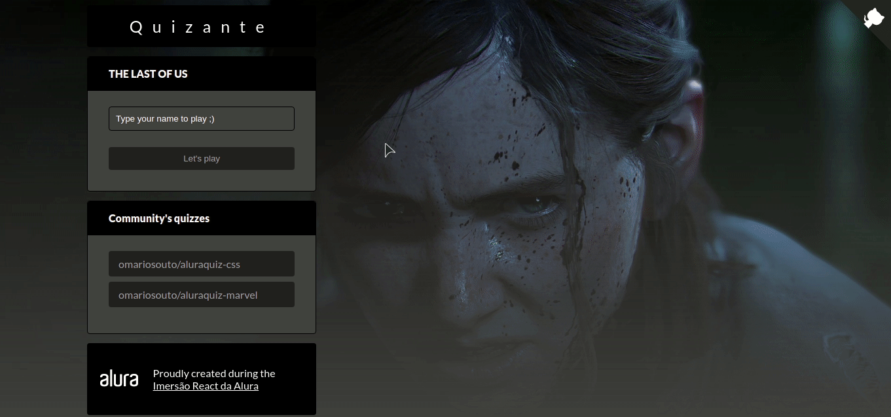

# Quizante

Um web-app construido com NextJS e Typescript.
<br>
<br>
### Imagens do projeto
<br>

Tela inicial             |  Tela de questão
:-------------------------:|:-------------------------:
  |  

Tela de erro             |  Tela de acerto
:-------------------------:|:-------------------------:
  |  

Tela inicial mobile             |  Tela de questão            | Tela de resultados
:-------------------------:|:-------------------------:|:-------------------------:
  |   | 

Preview             |
:-------------------------:|
  |
<br>
<br>

## Instalação

Para executar este projeto é necessário ter instalado o Node.js na versão 10.13 ou superior.

- Abra o diretório do projeto pelo terminal e execute os seguintes comandos:
```
yarn
```
ou
```
npm install
```
<br>

- Após rodar este comando, utilize o comando:
```
yarn dev
```
ou
```
npm run dev
```

### 🚀 Tecnologias utilizadas:
- Typescript;
- NextJS;
- ReactJS;

<br>

#### Projeto desenvolvido durante a Imersão React/Next da Alura.